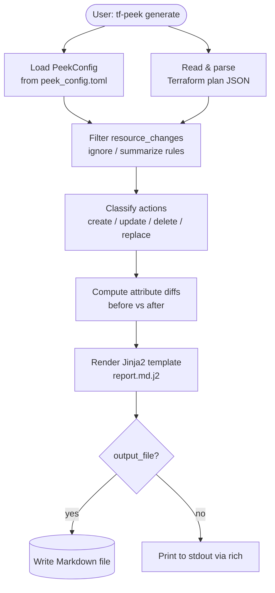
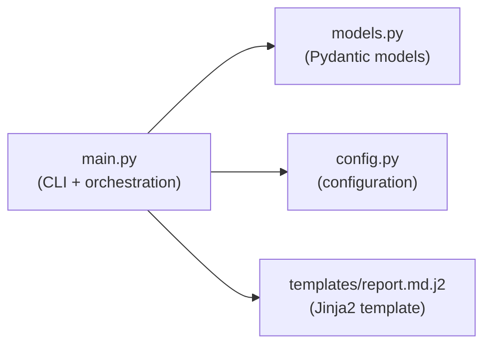

# CLI Entry Points and Data Flow

`tf-peek` is a pure CLI tool with no HTTP endpoints. The diagram below shows the single
command entry point and the flow of data through the system.

## CLI Command

```text
tf-peek generate <json_path> [--config <config_file>] [--output <output_file>]
```

| Argument / Option | Description                                                        |
| :---------------- | :----------------------------------------------------------------- |
| `json_path`       | Path to the Terraform plan JSON file (required)                    |
| `--config / -c`   | Path to a `peek_config.toml` override (optional)                   |
| `--output / -o`   | Path for the output Markdown report (optional, defaults to stdout) |

## Data Flow Diagram



## Internal Module Dependencies


