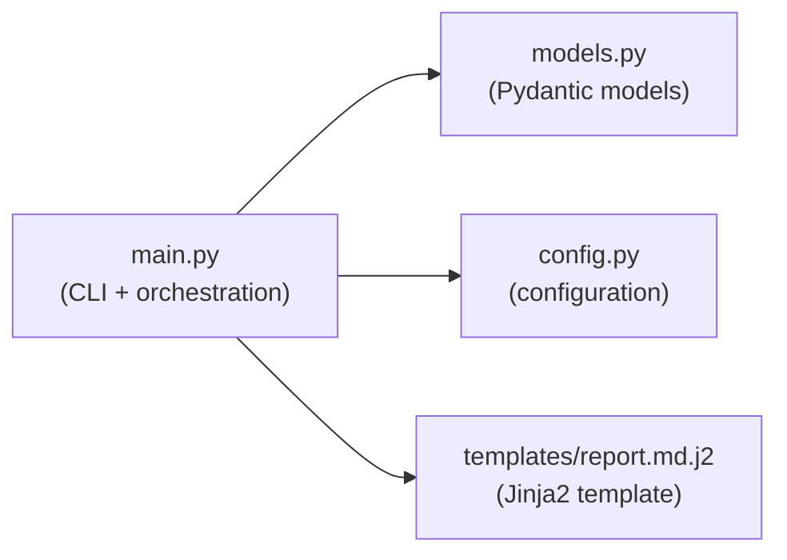

# CLI Entry Points and Data Flow

`tf-peek` is a pure CLI tool with no HTTP endpoints. The diagram below shows the single
command entry point and the flow of data through the system.

## CLI Command

```text
tf-peek [OPTIONS] JSON_PATH
```

The full option surface (`--config`, `--output`, `--show-sensitive`, `--version`, exit codes,
and example invocations) is documented in the [CLI Reference](../reference/cli.md).

## Data Flow Diagram

```mermaid
flowchart TD
    A([User: tf-peek]) --> B[Load PeekConfig\nfrom peek_config.toml]
    A --> C[Read & parse\nTerraform plan JSON]
    B --> D[Classify actions\ncreate / update / delete / replace\nno-op / read excluded]
    C --> D
    D --> E[Classify tier\nsilent / normal / critical\nvia [[resources]] rules]
    E --> F[Compute attribute diffs\nbefore vs after\n+ resolve nested after_unknown\nskip silent and summary]
    F --> F2[Mask sensitive attributes\nunless --show-sensitive]
    F2 --> F3[Format cells\nJSON + Markdown escaping]
    F3 --> G[Render Jinja2 template\nreport.md.j2]
    G --> H{output_file?}
    H -- yes --> I[(Write Markdown file\nUTF-8 / LF)]
    H -- no --> J[Emit Markdown literally via typer.echo]
```

## Internal Module Dependencies


```mermaid
flowchart LR
    main["main.py\n(CLI + orchestration)"]
    models["models.py\n(Pydantic models)"]
    config["config.py\n(configuration)"]
    tmpl["templates/report.md.j2\n(Jinja2 template)"]

    main --> models
    main --> config
    main --> tmpl
```
