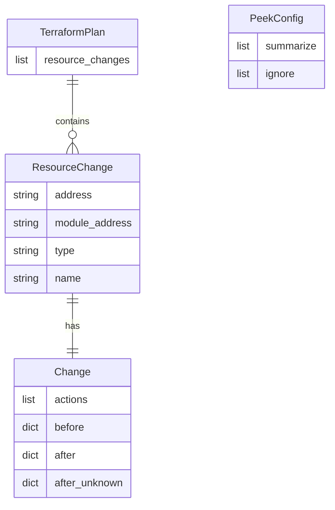

# Data Models

`tf-peek` does not use a database. All data models are in-memory Pydantic objects
that represent the structure of a Terraform plan JSON file, plus a configuration model.

## Models

### `TerraformPlan`

The root model, mapping directly to the top-level object of the JSON produced by
`terraform show -json`.

| Field              | Type                   | Description                      |
| :----------------- | :--------------------- | :------------------------------- |
| `resource_changes` | `list[ResourceChange]` | All resource changes in the plan |

### `ResourceChange`

Represents a single resource that will be created, updated, deleted, or replaced.

| Field            | Type     | Description                                                                   |
| :--------------- | :------- | :---------------------------------------------------------------------------- |
| `address`        | `str`    | Full Terraform resource address (e.g. `module.foo.google_storage_bucket.bar`) |
| `module_address` | `str`    | Module address (defaults to `"root"`)                                         |
| `type`           | `str`    | Resource type (e.g. `google_storage_bucket`)                                  |
| `name`           | `str`    | Resource name within its module                                               |
| `change`         | `Change` | The change block describing before/after state                                |

Computed properties:

| Property         | Type   | Description                                               |
| :--------------- | :----- | :-------------------------------------------------------- |
| `is_replacement` | `bool` | `True` when `actions` contains both `create` and `delete` |
| `simple_action`  | `str`  | One of `create`, `update`, `delete`, `replace`, `no-op`   |

### `Change`

Holds the before and after state of a resource's attributes.

| Field           | Type                     | Description                                                                     |
| :-------------- | :----------------------- | :------------------------------------------------------------------------------ |
| `actions`       | `list[str]`              | Raw Terraform actions (e.g. `["create"]`, `["update"]`, `["create", "delete"]`) |
| `before`        | `dict[str, Any] \| None` | Attribute values before the change                                              |
| `after`         | `dict[str, Any] \| None` | Attribute values after the change                                               |
| `after_unknown` | `dict[str, Any] \| None` | Attributes whose values are unknown until apply                                 |

### `PeekConfig`

Application configuration loaded from `peek_config.toml`.

| Field       | Type        | Description                                                       |
| :---------- | :---------- | :---------------------------------------------------------------- |
| `summarize` | `list[str]` | Resource type prefixes to include without showing attribute diffs |
| `ignore`    | `list[str]` | Resource type prefixes to exclude from the report entirely        |

## Entity-Relationship Diagram



## Configuration File Format

`peek_config.toml` follows this structure:

```toml
[filters]
summarize = [
    "google_project_iam_member",
]

ignore = [
    "random_id",
    "null_resource",
]
```
